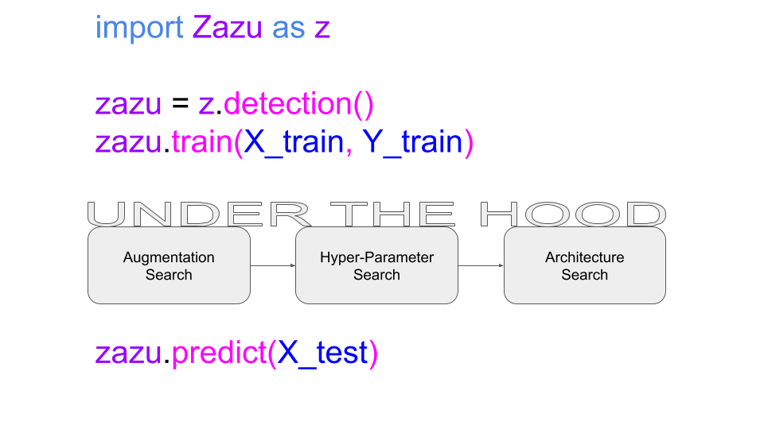
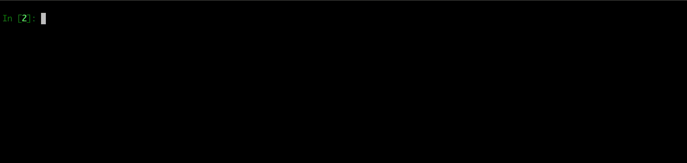

     

This is an easy open-source AutoML framework for object detection. This project contains an
architecture  search + hyper-parameter search + augmentations search, as well as trial manager. 
An ML Pipeline taylor made for simple integration into your project or code.

  
  

### *Algorithms*

| *Augmentations Search* | *Hyper-Parameter Search* | *Architecture Search*
| :----:         |     :----:      |    :----:      |
|  <ul><li>Fast-Autoaugment</li></ul>    | <ul><li>Random Search</li><li>HyperBand</li></ul>     | <ul><li>Your Model</li></ul>  |
### *Super EASY to use!*

  

## *Why ZazuML?*
You might be building an ML pipeline to avoid model performance degeneration, or maybe you're just too lazy to download, 
debug, and tune your own model. Either way, you shouldn't be focusing your efforts on simple things like detection. There's
a whole world out there for you to explore, give your hand at trajectory prediction or action recognition and let *ZazuML*
free you up from the boring stuff.

- Get started with [Quick Start](DOCS/GETTINGSTARTED.md)
- Read up on [Configuring ZazuML](DOCS/CONFIGURINGZAZU.md)
- Launch [ZazuML remotely](DOCS/REMOTEZAZU.md)
- Take a look [Under The Hood](DOCS/UNDERTHEHOOD.md)
- Customize by [adding your own models](DOCS/ADDINGMODELS.md)

## *TO DO*

- Increase search space
- NAS to replace some of the HP search
- Intelligent Losses to replace some of the HP search

## *Want to contribute*

If you're interested in becoming a collaborator or just have some questions, feel free to join our <a href="https://join.slack.com/t/zazuml/shared_invite/zt-h0brn54k-wFIH7HWxXlummmpWaDr3ZA">slack</a> community.

## *Refrences*

Some of the code was inspired by [keras-tuner](https://github.com/keras-team/keras-tuner)
