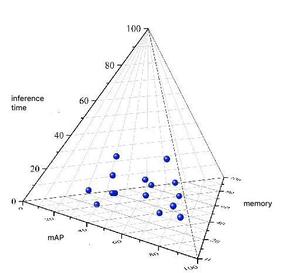

<br/><br/>   

This is an open-source AutoML project. Currently this project contains a model finder, hyper-parameter tuner, 
and trial manager all wrapped up in one synchronous end to end program. The input to this program is a dataset and your
priorities, the output is a trained model with auto-optimized hyper parameters, ready to run inference, simple as that.

**NOTE**: This project is still under development, clone and play, we appreciate and encourage
pull requests and feedback from the community. Help us make this tool awesome.

## *Why ZazuML?*
You might be building an ML pipeline to avoid model performance degeneration, or maybe you're just too lazy to download, 
debug, and tune your own model. Either way, you shouldn't be focusing your efforts on simple things like detection. There's
a whole world out there for you to explore, give your hand at trajectory prediction or action recognition and let *ZazuML*
free you up from the boring stuff.

## Under the hood
*ZazuML* is built up from 4 main packages, 

1. The *Model Selector* is in charge of selecting the optimal model based on the 
priorities of the user.

2. The *Tuner* searches for hyper-parameters, manages and keeps track of trials

3. The *Launchpad* is in charge launching local or remote trials and distribution of gpu resources amongst trials

4. The [Zazu Model Zoo](https://github.com/dataloop-ai/zoo), was once known as
 the *ZaZOO* (my little joke), but to avoid confusion we renamed to just plane old *ZOO*.



The tetrahedron in the image above represents a vector space where each model occupies a unique 
position with it's own advantages and short comings. *ZazuML* computes the minimal euclidean distance 
between your priorities and model architecture. 


## Getting started

First thing to do is . . .  

### *pull & run the Docker Image*
```
docker run --rm -it --init  --runtime=nvidia  --ipc=host  -e NVIDIA_VISIBLE_DEVICES=0 buffalonoam/zazu-image:0.1 bash
```
Be sure to update the nvidia-devices flag!


### *clone the repo*
```
git clone https://github.com/dataloop-ai/ZazuML.git
cd ZazuML
git clone https://github.com/dataloop-ai/zoo.git
```

The next thing to do is edit the configs.json file

### *configs.json example*
```
{
  "max_trials": 1,
  "max_instances_at_once": 1,
  "model_priority_space": [10, 0, 0],
  "task": "detection",
  "data": {
    "home_path": "/home/noam/data/coco",
    "annotation_type": "coco",
    "dataset_name": "2017"
  }
}
```
**max_trials** - defines the maximum total number of trials that will be tested

**max_instances_at_once** - defines the number of trials that will run simultaneously, 
i.e. in parallel to each other and must be smaller than the number of available gpus.

**model_priority_space** -  define the model specs that best suits your priorities.

This is a 3 dimensional vector describing your model preferences in a euclidean vector space.
Each element can occupy the space [0,10). 

- axis 0 - accuracy
- axis 1 - inference speed
- axis 2 - memory

For example "model_priority_space": [2, 9, 10] indicates a very light but low accuracy model

**task** - i.e. detection vs classification vs instance segmentation (we currently only support detection)

**data** - This is an example of how to run on a Coco styled dataset.


### ***Once you've finished editing your configs.json you're ready to begin!***

### *Begin model & hyper-parameter search*
```
python zazutuner.py --search
```
### *Begin training*
```
python zazutuner.py --train
```
### *predict*
```
python zazutuner.py --predict
```

### *Launch search on Kubernetes via our Dataloop engine* (this feature is not ready yet)
```
python zazutuner.py --search --remote
```

## TO DO

- Finish remote cloud deployment feature
- Stabilize version, improve search space and readability
- Implement BOHB instead of random search
- Make search space dependent on computational budget
- NAS to replace some of the HP search
- Intelligent Losses to replace some of the HP search

## Contact

If you're interested in becoming a collaborator or just have some questions, feel free to contact me at:

WeChat: BuffaloNoam   
Line: buffalonoam   
WhatsApp: +972524226459   

## Refrences

Some of the code was influenced by [keras-tuner](https://github.com/keras-team/keras-tuner)