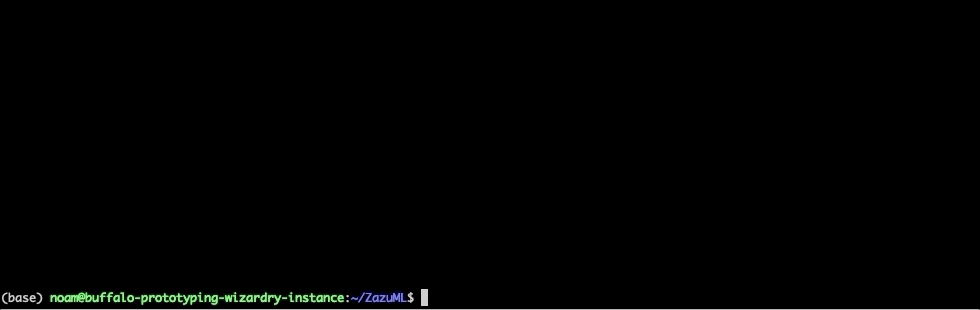
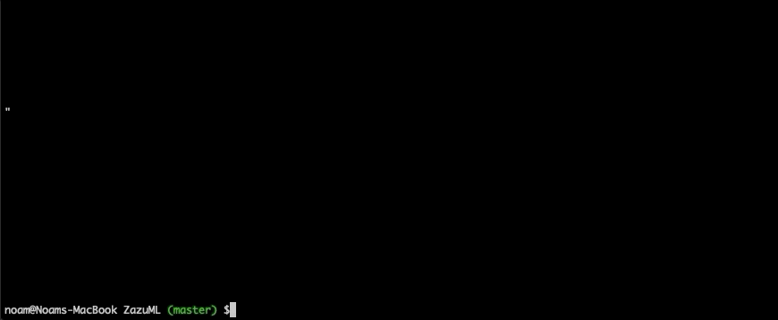

     

This is an easy open-source AutoML framework for object detection. Currently this project contains a model finder, hyper-parameter tuner, 
and trial manager all wrapped up in one synchronous end to end program. The input to this program is a dataset, the output is a trained 
model with auto-optimized hyper parameters, ready to run inference, simple as that.

### *Algorithms*

| *models* | *hyper-parameter optimization algorithms* |
| :----:         |     :----:      |
|  <ul><li>Retinanet</li><li>YoloV3</li></ul>    | <ul><li>Random Search</li><li>HyperBand (coming soon)</li></ul>     | 
  
### *Super EASY to use!*

  

## *Why ZazuML?*
You might be building an ML pipeline to avoid model performance degeneration, or maybe you're just too lazy to download, 
debug, and tune your own model. Either way, you shouldn't be focusing your efforts on simple things like detection. There's
a whole world out there for you to explore, give your hand at trajectory prediction or action recognition and let *ZazuML*
free you up from the boring stuff.

## *Launch Remote ZazuML*
ZazuML's *REMOTE* feature is designed so that you can run search, train and predict anywhere. No GPU's or complex Cloud APIs.
It's easy to implement into your python script or run in your terminal.

  

- Get started with [Quick Start](DOCS/GETTINGSTARTED.md)
- read up on [Configuring ZazuML](DOCS/CONFIGURINGZAZU.md)
- Launch [ZazuML remotely](DOCS/REMOTEZAZU.md)
- Take a look [Under The Hood](DOCS/UNDERTHEHOOD.md)

## *TO DO*

- Finish implementing HyperBand
- Increase search space
- NAS to replace some of the HP search
- Intelligent Losses to replace some of the HP search

## *Contact*

If you're interested in becoming a collaborator or just have some questions, feel free to contact me at:

WeChat: BuffaloNoam   
Line: buffalonoam   
WhatsApp: +972524226459   

## *Refrences*

Some of the code was inspired by [keras-tuner](https://github.com/keras-team/keras-tuner)